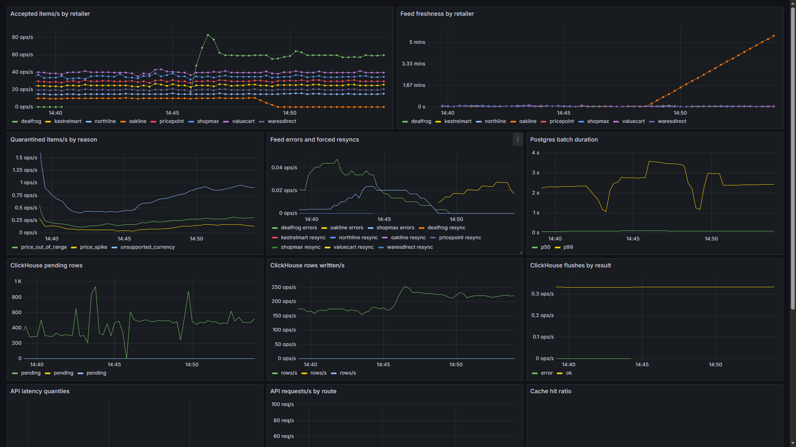

# dealstream

A deals-catalog backend built to be operated. Go services ingest eight simulated retailer feeds into Postgres, Redis, and ClickHouse, serve search, collections, price history, and similar-item recommendations, and report their own health through Prometheus and Grafana. Everything below that reads like a measurement is one, taken against the live system.

Built as a portfolio piece: the job it mirrors runs tens of millions of prices across Postgres, Redis, ClickHouse, and Milvus. This repo scales the same shape down to a small cloud footprint and keeps the operational habits that matter at the real size.

## Try it live

The whole stack runs on Railway. The API is public, ingestion is running against it right now, and the catalog below it holds 1.1M offers:

- [/deals](https://api-production-f55f8.up.railway.app/deals) current cross-retailer price dislocations
- [/search?q=drill&sort=price_asc](https://api-production-f55f8.up.railway.app/search?q=drill&sort=price_asc) full-text search, price-sorted
- [/products/11508](https://api-production-f55f8.up.railway.app/products/11508) one product with all its offers
- [/products/11508/history](https://api-production-f55f8.up.railway.app/products/11508/history) daily price history from the ClickHouse rollup
- [/products/11508/similar](https://api-production-f55f8.up.railway.app/products/11508/similar) pgvector nearest neighbors
- [/collections/camp-kit](https://api-production-f55f8.up.railway.app/collections/camp-kit) a rule-based collection computed from live prices

In a browser these routes render a designed HTML view; curl gets JSON. Both come from the same bytes: the showcase layer runs the real handler and renders whatever JSON it produced, so the two views cannot drift apart. Add `?format=json` to any page to see the raw payload.

## The system

```
feedgen  ->  ingestd  ->  Postgres (catalog: products, offers, quarantine)
 8 fake      validate      ClickHouse (price_events, daily rollup)
 retailer    dedupe        Redis (deals, hot caches)
 APIs        upsert            |
                            api (search, deals, collections, history, similar)
```

- **feedgen** simulates retailer APIs: an initial catalog sync endpoint plus an incremental change feed with cursors. Products come from a seeded deterministic universe, so a million-offer catalog costs no memory and restarts serve identical data. Each retailer has a mess profile: duplicated SKUs with mangled formatting, prices as cents, floats, or strings that drift mid-feed, wrong currencies, stale timestamps, unit bugs that multiply a price by 100.
- **ingestd** polls every feed, normalizes each item or quarantines it with a reason, and writes in batches: multi-row upserts to Postgres, buffered inserts to ClickHouse. Cursors persist in Postgres, so a restart resumes instead of resyncing. When a feed answers 410 (cursor expired or sequence reset), the worker falls back to a full catalog resync on its own.
- **api** serves reads. Postgres is the source of truth, ClickHouse answers history queries from a pre-aggregated daily rollup, Redis holds the materialized deals list and short-TTL caches. Recommendations are a pgvector nearest-neighbor query over attribute-hash embeddings.

## Numbers

From the seed run and the live system:

- 1,098,723 offers across 8 retailers, 426,837 products, seeded in about 2 minutes (~9,000 offers/s) including validation, dedupe, and history writes
- The product count is itself a check: with each retailer carrying a fixed share of a 450,000-product universe, the expected number of products no retailer carries is ~5%, predicting ~427,000 products. The pipeline landed within 500 of it.
- 4,547 items quarantined during the seed with per-reason counts (`unsupported_currency` 3,417, `price_out_of_range` 1,108, `price_spike` 22), every raw payload kept and replayable
- 427,001 products embedded in under 2 minutes; the IVFFlat index built in 42 seconds
- ClickHouse holds every accepted observation (8M+ rows on day one, since every full resync re-observes the whole catalog; ~150 rows/s at steady state) yet history queries stay flat, because charts read the daily rollup

## Validation policy

Strict on values, lenient on presentation. SKU formatting differences and price wire formats are normalized silently; those are presentation. Values that cannot be trusted are quarantined with a reason, kept, and counted as a first-class metric:

- Absolute price bounds catch the ×100 unit bug for anything from $20 up
- A relative check catches it below that: an update 20× away from the price already held is a spike, not a deal. The check self-heals: if a "spike" persists across three consecutive observations, it is accepted as the truth, so one corrupt first observation cannot wedge an offer against every later correction
- Non-USD currencies are rejected by policy rather than guessed at
- Timestamps from the future are rejected; stale ones are accepted and handled by a last-write-wins guard on the offer row, so out-of-order updates cannot regress a price

Duplicates inside a batch collapse by normalized SKU (latest timestamp wins); duplicates across retailers are the point of the catalog and merge into one product.

## Things that broke and what they taught

These are kept in the commit history on purpose.

1. **Concurrent upsert deadlock.** Eight workers upserting overlapping product sets hit Postgres deadlocks (`40P01`) within seconds of the first parallel run: Go map iteration randomized row order, so two batches acquired the same row locks in opposite orders. Fix: both batch statements write in sorted key order. Deterministic lock order is cheaper than retry loops.
2. **Feed sequence reset.** Restarting feedgen reset its update sequences, and consumers whose cursors were now ahead of the feed polled empty pages forever, looking perfectly healthy. The feed now answers 410 to a cursor from the future, and the worker resyncs. Verified live: one restart sent all eight workers through the resync path.
3. **ClickHouse under memory pressure.** Lowering the container's memory cap mid-run got ClickHouse OOM-killed repeatedly; every flush during the outages failed with connection errors. The buffered writer requeues failed batches, so when the cap was raised, every row landed. Count checked out afterward: nothing lost.
4. **A frozen freshness gauge.** Freshness was first exported as "seconds since last accepted item", set when items arrived. Killing a retailer in a chaos run exposed the flaw: the gauge froze at its last healthy value precisely when it should have been climbing. It is now exported as a last-accept timestamp and derived in PromQL as `time()` minus that, so a silent feed's staleness rises on its own ([the chaos capture](docs/img/dashboard-chaos-oakline.png) shows one retailer climbing past 5 minutes while seven sit at zero).

## The review round

Before publishing, the whole repo went through an adversarial multi-agent code review: eight reviewers hunting from different angles, every candidate finding verified by a separate agent told to refute it. Seventeen real defects survived verification, all in the resilience paths that only fire under failure. The instructive ones:

- **The spike check could wedge an offer forever.** A corrupt first observation became the held price, and every honest correction afterward looked 20× away from it and got rejected. Fixed with the persistence rule above.
- **The feed cursor could outrun the history store.** The cursor was saved after the Postgres write but before the buffered ClickHouse flush, so a crash in that window lost observations the cursor claimed were done. Workers now wait on a flush watermark before saving; the writer groups their waits into one insert, and a crash replays a page instead of losing it (replays are safe on both stores).
- **"Drained" was guessed from page size.** A worker compared items received against the page size it asked for, but two retailers clamp pages lower, so those feeds read as permanently drained and were polled at idle speed while backlogged. The feed now says `has_more` itself.
- **A feed restart could silently alias cursors.** Sequences reset on restart, and an old cursor number can look valid in the new sequence space. Every response now carries the feed instance's epoch, and a mismatch forces a resync instead of quietly serving the wrong window.
- **Database outages read as 404s.** Handlers mapped every lookup error to "not found", so a Postgres outage would have looked like an empty catalog to clients. Missing rows and failures now split into 404 and 500.
- **The ClickHouse buffer had no ceiling.** A long outage grew the requeue without bound. It is now capped; past the cap the oldest rows drop and a counter says exactly how many, because bounded memory with an honest metric beats an eventual OOM.

The rest of the batch: search's candidate cap kept the lowest product ids instead of the best-ranked matches (and the response now flags truncation), cache misses stampeded Postgres without request coalescing, quarantined spikes stored a summary instead of the replayable raw payload, and a handful of smaller ones in the same spirit. Every fix landed with the review's failure scenario as its test where one was cheap to write.

## Observability

Every service exposes Prometheus metrics, and the Grafana dashboard is provisioned from JSON in this repo, so the dashboard and the metric names cannot drift apart. The panels answer operator questions directly:

- Is data fresh? Per-retailer freshness (seconds since the newest accepted item) and accepted items/s
- Is data clean? Quarantine rate broken down by reason
- Are the stores healthy? ClickHouse pending buffer, flush results, Postgres batch latency
- Is the API fast? Latency quantiles per route, cache hit ratio, requests/s

Chaos controls (`scripts/chaos.sh`) kill or degrade a retailer at runtime. A dead retailer shows up as climbing freshness and error rates while the other seven keep ingesting; recovery is visible the same way.



A 45-minute window with everything in it, two chaos rounds and three load tests: [docs/img/dashboard-45min.png](docs/img/dashboard-45min.png). The first chaos capture, before the freshness metric was fixed, is kept too: [docs/img/dashboard-chaos-dealfrog.png](docs/img/dashboard-chaos-dealfrog.png).

## Load, and the three rounds it took

k6 runs a browse mix (`scripts/load.js`): search, product detail, history, similar deals, deals, collections. 30 virtual users, 5 minutes, against the live stack with ingestion running. The first run was a collapse, and the path out is the most instructive part of the repo:

| | run 1 | run 3 |
|---|---|---|
| throughput | 1.9 req/s | 28.6 req/s |
| median request | 12.9 s | 31 ms |
| p95 | 36.6 s | 3.3 s |
| failed requests | 6.3% | 0% |

1. **Run 1: everything except `/deals` drowned.** The Redis-served route held 17 ms medians while every Postgres route sat at 8 to 21 seconds. That split identified the bottleneck before any profiling: queries, not network, not Go. Search aggregated offers for every full-text match, so one broad term held a connection for seconds and everything queued behind it. Fixes: search aggregates at most 1,000 candidates (the best-ranked matches, with truncation flagged in the response) and caches results for 30 s, retailer names moved to an in-process cache, and the connection pool got an explicit cap so the queue forms in the app instead of inside Postgres.
2. **Run 2: history fell from 7.3 s to 37 ms, and the next whale surfaced.** Collections with no category filter aggregated the entire catalog per cold load; p90 hit the 60-second timeout. `EXPLAIN (ANALYZE, BUFFERS)` showed the category variant probing 222,784 product rows to find 2,500 matches, because category lived on `products` while price lived on `offers`. Fix: category and brand are denormalized onto offers at write time with composite partial indexes, and the collection query walks `(category, price_cents)` in order and stops early. Cold collection loads went from 16 to 60 s down to under 2 s.
3. **Run 3 is the table above.** The remaining p95 tail is cold search variants doing full-text scans on a 1 vCPU Postgres across a real network hop, with ingestion writing concurrently. On this hardware that tail is a fact, and the dashboard makes it visible rather than hiding it.

The dashboard also shows what load costs the write side: during each k6 run, ingest batch p99 climbs to 20 s and feed freshness sawtooths to 2 to 3 minutes as reads and writes contend for the same small Postgres, then both recover the moment load stops. That coupling, and the case for read replicas or bigger hardware at real scale, is exactly what the freshness panel is for.

## Honest deviations from the job's stack

- **pgvector instead of Milvus.** At 427k vectors, Postgres with an IVFFlat index answers in milliseconds and removes an entire service from the operational surface. At tens of millions of vectors with heavy write churn, a dedicated vector store earns its keep; the recommendation query is isolated behind one function so the swap is contained.
- **Attribute-hash embeddings instead of a learned model.** Feature hashing over category, brand, and title tokens is deterministic, explainable, and free. The play here is the retrieval plumbing; a model upgrade changes one package.
- **Axiom is absent.** Structured logs go to stdout; the log-aggregation seat in this setup is empty. Prometheus and Grafana carry the observability story.
- **Everything runs on a small Railway project**: Postgres with pgvector, Redis, ClickHouse, and the three Go services (Dockerfiles in `deploy/`). The seed and load numbers were measured with the services running on a dev machine against the same Railway databases, so they include real network round trips, not localhost flattery.

## Running it

Requires Go 1.26+, a Postgres 16 with pgvector, Redis, and ClickHouse (compose file in `deploy/`, or any hosted equivalents), and a `.env` with `PG_DSN`, `REDIS_ADDR`, `REDIS_PASSWORD`, `CH_ADDR`, `CH_USER`, `CH_PASSWORD`, `CH_DB`.

```
go run ./cmd/migrate        # apply schemas (tracked in schema_migrations)
go run ./cmd/feedgen        # fake retailer APIs on :8081
go run ./cmd/ingestd        # catalog sync, then incremental polling
go run ./cmd/api            # read API on :8080
go run ./cmd/embed          # embed products, build the vector index
go run ./cmd/dbstat         # row counts and freshness at a glance
```

Prometheus scrape config and the Grafana dashboard live under `deploy/`. Layout: `cmd/` entrypoints, `internal/feedgen` the simulator, `internal/ingest` normalize/quarantine/upsert, `internal/api` handlers, `internal/embed` vectors, `db/` schemas.
